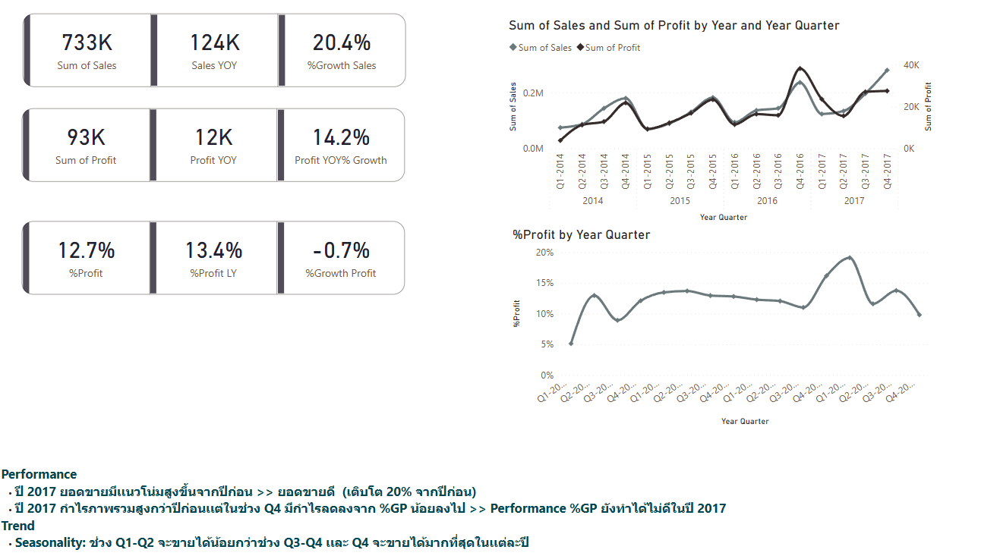
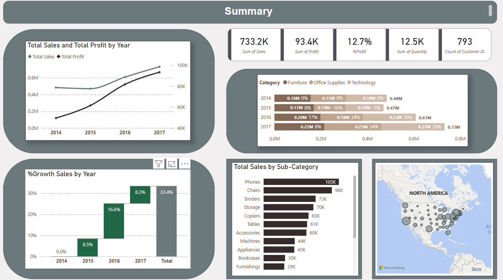
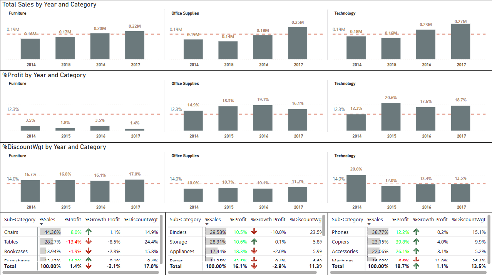

# 📊 SuperStore Sales Analysis (Power BI Project)

> วิเคราะห์ยอดขาย กำไร และพฤติกรรมลูกค้าจากชุดข้อมูล Superstore ด้วย Power BI  
> พร้อมระบุปัญหาเชิงธุรกิจ และแนวทางปรับกลยุทธ์ด้วย Data-Driven Dashboard






---

## 🎯 Objective

- วิเคราะห์ยอดขาย (Sales) และกำไรสุทธิ (%Profit Margin)
- ตรวจจับสินค้าที่ขายดีแต่กำไรต่ำ
- เปรียบเทียบผลการดำเนินงานตามกลุ่มลูกค้า, หมวดสินค้า, พื้นที่ และช่วงเวลา
- สนับสนุนการตัดสินใจด้วย Dashboard ที่ครอบคลุมและตอบคำถามทางธุรกิจได้

---

## 📊 รายงานประกอบด้วย

| 📄 หน้า | รายละเอียด |
|--------|-------------|
| **Descriptive** | สรุปสิ่งที่เกิดขึ้นด้านยอดขาย กำไร เเละยอดขายตามฤดูกาล |
| **Summary** | สรุปสาระสำคัญจากข้อมูลทั้งหมด |
| **Product Profitability** | วิเคราะห์ %Profit แยกตาม Category / Sub-Category |
| **Customer Focus** | วิเคราะห์ลูกค้าโฟกัสที่ทำให้ %Profit ลดลง |

---

## 🧮 Key DAX Measures

```dax
-- ยอดขายรวม
Total Sales = SUM('Sales'[Sales])

-- กำไรรวม
Total Profit = SUM('Sales'[Profit])

-- % กำไรสุทธิ
% Profit Margin = DIVIDE([Total Profit], [Total Sales])

-- ยอดขายเทียบปีที่ผ่านมา
Sales LY = CALCULATE([Total Sales], SAMEPERIODLASTYEAR('Date'[Date]))

-- % การเติบโตของยอดขาย YoY
% Sales YoY Growth = DIVIDE([Total Sales] - [Sales LY], [Sales LY])

-- Rank Sub-Category ตาม %Growth
Rank by Growth = 
RANKX(
  FILTER(ALL('Product'), 'Product'[Category] = MAX('Product'[Category])),
  [% Sales YoY Growth],
  ,
  DESC
)
